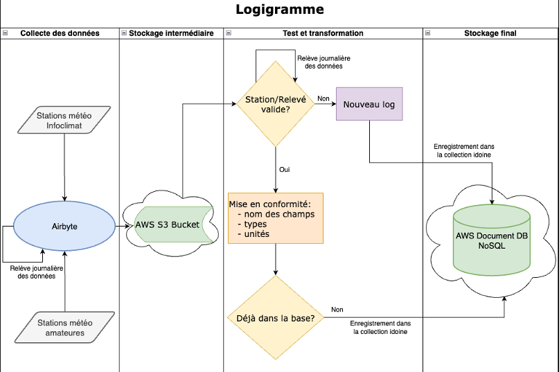
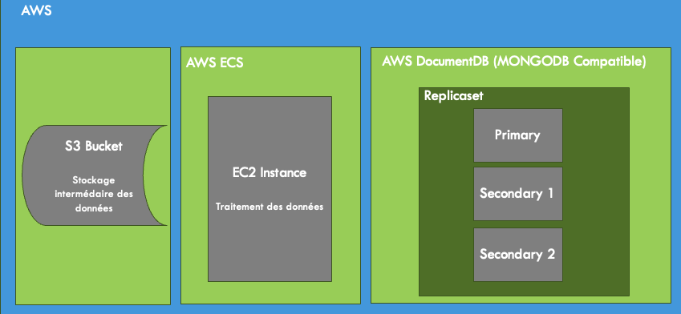

# Data integration

Ce projet fait l'intégration dans une base de données Mongo sur AWS de sources de différents serveurs.

## Prérequis

- docker
- docker-compose
- AWS DocumentDB (MONGODB Compatible)

## Logigramme



## Services AWS utilisés



## Installation

1. **Cloner le dépôt**

```bash
git clone https://github.com/nau81000/data_integration.git
cd data_integration
```

2. **Définir les variables dans docker-compose.yml**

```bash
cp docker-compose.yml.template docker-compose.yml
```

| Variable | Description |
| -------- | -------     |
| AWS_ACCESS_KEY_ID | Clé d'accès aux services AWS |
| AWS_SECRET_ACCESS_KEY | Clé d'accès secrête  aux services AWS |
| DB_NAME | Nom donné à la base |
| DB_SERVER | URL du serveur MongoDB |

## Utilisation

Docker-compose permet de créer automatiquement l'environnement de travail: création et initialisation des bases de données, lancement des services.

- Construction de l'environnement avec la commande:

```
docker-compose up -d
```

- Destruction des containers de l'environnement avec la commande:

```
docker-compose down -v
```

- Destruction des volumes de l'environnement et de tous les volumes Docker inutilisés avec la commande: 

```
rm -rf docker && docker volume prune -f -a
```

